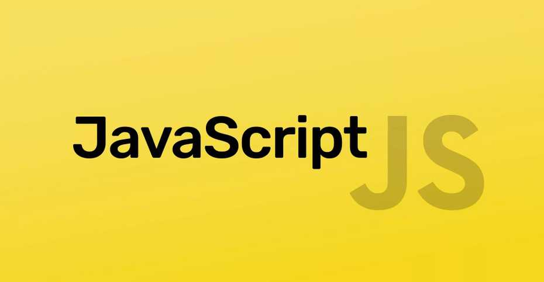

## JavaScript là gì? Ngôn ngữ giúp trang web của bạn "sống dậy"

Bạn đã bao giờ tự hỏi làm thế nào một trang web có thể hiển thị thông báo, thay đổi nội dung khi bạn nhấn một nút, hay tạo ra những hiệu ứng chuyển động mượt mà chưa? Đằng sau tất cả những "phép màu" đó chính là JavaScript (thường được viết tắt là JS).

Nếu bạn đang bắt đầu hành trình trở thành một nhà phát triển web, thì JavaScript chính là một trong những người bạn đồng hành không thể thiếu. Trong bài viết mở đầu cho series "Làm chủ JavaScript", chúng ta sẽ cùng tìm hiểu xem ngôn ngữ này là gì và tại sao nó lại quan trọng đến vậy.

## Bộ ba không thể tách rời của Web

Để hiểu rõ vai trò của JavaScript, hãy tưởng tượng việc xây dựng một trang web giống như xây một ngôi nhà:

HTML (HyperText Markup Language): Là bộ khung của ngôi nhà. Nó xác định cấu trúc cơ bản như tường, sàn, mái nhà (ví dụ: các tiêu đề, đoạn văn, hình ảnh).

CSS (Cascading Style Sheets): Là phần trang trí nội thất. Nó quyết định màu sơn, kiểu dáng đồ đạc, cách sắp xếp các phòng (ví dụ: màu sắc chữ, font chữ, bố cục trang).

JavaScript: Là hệ thống điện nước và các thiết bị thông minh. Nó giúp ngôi nhà của bạn trở nên "sống động" và tương tác được. Đèn sẽ bật khi bạn bấm công tắc, cửa tự động mở, TV hiển thị chương trình bạn chọn.

Một trang web chỉ có HTML và CSS giống như một ngôi nhà đẹp nhưng tĩnh lặng. JavaScript chính là thứ thổi hồn vào, biến nó thành một không gian sống động và hữu ích.

## JavaScript có thể làm được những gì?

Sức mạnh của JavaScript nằm ở khả năng thao túng gần như mọi thứ trên một trang web. Dưới đây là một vài ví dụ điển hình:

Thay đổi nội dung HTML: Thêm, xóa hoặc cập nhật bất kỳ văn bản, hình ảnh nào trên trang mà không cần tải lại.

Phản hồi lại hành động của người dùng: Bắt các sự kiện như click chuột, gõ phím, cuộn trang để thực thi một hành động nào đó (ví dụ: hiển thị một biểu mẫu khi người dùng nhấp vào nút "Đăng ký").

Thay đổi CSS: Tự động thay đổi màu sắc, kích thước, vị trí của các phần tử để tạo hiệu ứng hoặc chuyển trang sang chế độ ban đêm (dark mode).

Gửi và nhận dữ liệu: Giao tiếp với máy chủ để tải dữ liệu mới và cập nhật lên trang web mà không cần người dùng phải làm gì cả (đây là công nghệ cốt lõi của các ứng dụng hiện đại như Facebook, Google Maps).

## JavaScript chạy ở đâu?

Ban đầu, JavaScript được sinh ra để chạy trên trình duyệt web của người dùng (client-side). Mọi trình duyệt hiện đại ngày nay, từ Chrome, Firefox đến Safari, đều có một "engine" JavaScript tích hợp sẵn để thực thi các đoạn mã này.

Tuy nhiên, với sự ra đời của Node.js, JavaScript đã có một bước nhảy vọt ngoạn mục. Giờ đây, nó còn có thể chạy được trên máy chủ (server-side), cho phép các lập trình viên xây dựng toàn bộ một ứng dụng web chỉ bằng một ngôn ngữ duy nhất!

## Tại sao bạn PHẢI học JavaScript?

Nền tảng của Lập trình Web: Nếu bạn muốn trở thành một nhà phát triển Front-end, việc học JavaScript là bắt buộc. Không có lựa chọn thay thế nào khác.

Cực kỳ phổ biến và linh hoạt: Đây là một trong những ngôn ngữ lập trình phổ biến nhất thế giới. Hệ sinh thái của nó vô cùng rộng lớn với hàng triệu thư viện và framework (như React, Angular, Vue.js) giúp bạn xây dựng mọi thứ từ website đơn giản đến ứng dụng phức tạp.

Cộng đồng lớn, tài liệu dồi dào: Gặp khó khăn? Chỉ cần tìm kiếm trên Google, bạn sẽ có ngay câu trả lời từ một cộng đồng khổng lồ sẵn sàng giúp đỡ.

## Tổng kết

JavaScript là một ngôn ngữ năng động, thú vị và đầy quyền năng. Nó là chiếc chìa khóa mở ra cánh cửa để bạn tạo nên những trải nghiệm web tương tác và tuyệt vời cho người dùng.

Chào mừng bạn đã đến với thế giới của JavaScript! Trong bài viết tiếp theo của series, chúng ta sẽ cùng nhau thiết lập môi trường và viết dòng mã "Hello, World!" đầu tiên để chính thức bắt đầu hành trình thú vị này.

---

## Các bài viết trong series

- **Bài 1:** [Cách JavaScript "giao tiếp" với HTML và "Hello, World!"](./javascript-hello-world/)
- **Bài 2:** [Biến (var, let, const) và "Trí nhớ" của JavaScript](./javascript-bien-kieu-du-lieu/)
- **Bài 3:** [Hàm (Functions) - Những cỗ máy tái sử dụng](./javascript-ham-functions/)
- **Bài 4:** [Giới thiệu về DOM - Khi JavaScript gặp HTML](./javascript-dom-interaction/)
- **Bài 5:** [Bắt sự kiện (Events) - Khiến trang web tương tác](./javascript-events/)
- **Bài 6:** [Sức mạnh của Mảng (Arrays) - Lưu trữ và xử lý danh sách](./javascript-mang-arrays/)
